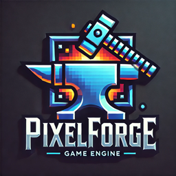

# Forge



Forge is a browser based, code only game engine. It has everything you'd expect from an engine including rendering, auio, input, animations, ecs, etc.

## Installation
Clone the repository and install the dependencies:
``` sh
git clone https://github.com/stormmuller/PixelForge.git
cd PixelForge
npm install
```

## Running the Demo
To run the demo application:
``` sh
npm run demo:dev
```

## Building the Project
To build the project:
``` sh
npm run build
```

Running Tests
To run the tests:
```sh
npm test
```
## What the engine is

The engine is where all the code is stored that is usable for most types of games. For example: the renderer, audio systems, animations, mouse pointer, etc.

## What the engine is not

The engine is not a place to store code that is hyper specific to a game. For example: a system for collecting coins.

## What if my system is specific to a particular genre?

You can make a seperate folder or package outside of the engine.

## Acknowledgements
 - [Howler.js](https://howlerjs.com/)
 - [Vite](https://vite.dev/)
 - [Rive](https://rive.app/)